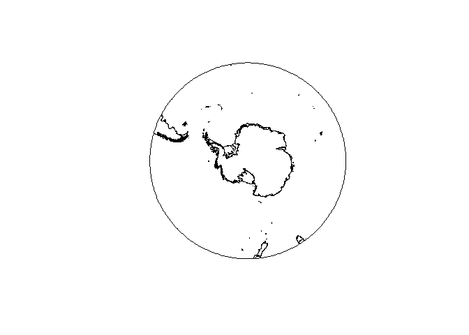

<!-- README.md is generated from README.Rmd. Please edit that file -->
[](https://travis-ci.org/SCAR-sandpit/quantarcticR)
[](https://ci.appveyor.com/project/SCAR-sandpit/quantarcticR)
[](https://www.tidyverse.org/lifecycle/#experimental)
[](https://codecov.io/github/SCAR-sandpit/quantarcticR?branch=master)

quantarcticR
============

Quantarctica is a collection of Antarctic geographical datasets which works with the free, cross-platform, open-source software QGIS. It includes community-contributed, peer-reviewed data from ten different scientific themes and a professionally-designed basemap.

The `quantarcticR` package provides access to Quantarctica data sets for R users, **without** needing QGIS to be installed. R users can use these data sets with e.g. the `raster`, `sp`, or `sf` packages.

Installation
------------

You can install the development version of quantarcticR from GitHub with:

``` r
remotes::install_github("SCAR-sandpit/quantarcticR")
```

quantarcticR uses the Bowerbird package, so you may also need to install this package if you don't have it already.


``` r
remotes::install_github("ropensci/bowerbird", build_vignettes = TRUE)
```

This is very much a work in progress!

Example
-------

``` r
library(quantarcticR)
#> Quantarctica is made available under a CC-BY license.
#> If you use it, please cite it:
#> Matsuoka K, Skoglund A, Roth G (2018) Quantarctica [Data set]. Norwegian Polar Institute.
#> https://doi.org/10.21334/npolar.2018.8516e961
```

List all available datasets:

``` r
ds <- qa_datasets()
head(ds)
#> # A tibble: 6 x 8
#>   layername      
#>   <chr>          
#> 1 10-dg latitude 
#> 2 10-dg longitude
#> 3 15-dg latitude 
#> 4 15-dg longitude
#> 5 15-min latitude
#> 6 1-dg latitude  
#>   datasource                                                               
#>   <chr>                                                                    
#> 1 "C:\\Users\\ben_ray\\AppData\\Local\\Temp\\Rtmpa8Wxe0/quantarcticR-cache~
#> 2 "C:\\Users\\ben_ray\\AppData\\Local\\Temp\\Rtmpa8Wxe0/quantarcticR-cache~
#> 3 "C:\\Users\\ben_ray\\AppData\\Local\\Temp\\Rtmpa8Wxe0/quantarcticR-cache~
#> 4 "C:\\Users\\ben_ray\\AppData\\Local\\Temp\\Rtmpa8Wxe0/quantarcticR-cache~
#> 5 "C:\\Users\\ben_ray\\AppData\\Local\\Temp\\Rtmpa8Wxe0/quantarcticR-cache~
#> 6 "C:\\Users\\ben_ray\\AppData\\Local\\Temp\\Rtmpa8Wxe0/quantarcticR-cache~
#>   layer_attributes srs_attributes   provider abstract extent    cached
#>   <list>           <list>           <chr>    <chr>    <list>    <lgl> 
#> 1 <list [14]>      <tibble [1 x 4]> ogr      <NA>     <dbl [4]> FALSE 
#> 2 <list [14]>      <tibble [1 x 4]> ogr      <NA>     <dbl [4]> FALSE 
#> 3 <list [14]>      <tibble [1 x 4]> ogr      <NA>     <dbl [4]> FALSE 
#> 4 <list [14]>      <tibble [1 x 4]> ogr      <NA>     <dbl [4]> FALSE 
#> 5 <list [14]>      <tibble [1 x 4]> ogr      <NA>     <dbl [4]> FALSE 
#> 6 <list [14]>      <tibble [1 x 4]> ogr      <NA>     <dbl [4]> FALSE
```

Fetch one and plot it:

``` r
res <- qa_get("ADD Simple basemap", verbose = TRUE)
#> 
#> Fri Feb 08 01:16:17 2019
#> Synchronizing dataset: ADD Simple basemap
#> Source URL http://quantarctica.tpac.org.au/Quantarctica3/Miscellaneous/SimpleBasemap/
#> --------------------------------------------------------------------------------------------
#> 
#>  this dataset path is: C:\Users\ben_ray\AppData\Local\Temp\Rtmpa8Wxe0\quantarcticR-cache/Miscellaneous//SimpleBasemap
#>  visiting http://quantarctica.tpac.org.au/Quantarctica3/Miscellaneous/SimpleBasemap/ ... 9 download links, 0 links to visit done.
#>  downloading file 1 of 9: http://quantarctica.tpac.org.au/Quantarctica3/Miscellaneous/SimpleBasemap/ADD_DerivedLowresBasemap.cpg ...  done.
#>  downloading file 2 of 9: http://quantarctica.tpac.org.au/Quantarctica3/Miscellaneous/SimpleBasemap/ADD_DerivedLowresBasemap.dbf ...  done.
#>  downloading file 3 of 9: http://quantarctica.tpac.org.au/Quantarctica3/Miscellaneous/SimpleBasemap/ADD_DerivedLowresBasemap.prj ...  done.
#>  downloading file 4 of 9: http://quantarctica.tpac.org.au/Quantarctica3/Miscellaneous/SimpleBasemap/ADD_DerivedLowresBasemap.qix ...  done.
#>  downloading file 5 of 9: http://quantarctica.tpac.org.au/Quantarctica3/Miscellaneous/SimpleBasemap/ADD_DerivedLowresBasemap.shp ...  done.
#>  downloading file 6 of 9: http://quantarctica.tpac.org.au/Quantarctica3/Miscellaneous/SimpleBasemap/ADD_DerivedLowresBasemap.shx ...  done.
#>  downloading file 7 of 9: http://quantarctica.tpac.org.au/Quantarctica3/Miscellaneous/SimpleBasemap/ADD_DerivedLowresBasemap.txt ...  done.
#>  downloading file 8 of 9: http://quantarctica.tpac.org.au/Quantarctica3/Miscellaneous/SimpleBasemap/ADD_DerivedLowresBasemap_Subantarctic.txt ...  done.
#>  downloading file 9 of 9: http://quantarctica.tpac.org.au/Quantarctica3/Miscellaneous/SimpleBasemap/ADD_General.txt ...  done.
#> 
#> Fri Feb 08 01:16:18 2019 dataset synchronization complete: ADD Simple basemap

library(raster)
#> Warning: package 'raster' was built under R version 3.4.2
#> Loading required package: sp
#> Warning: package 'sp' was built under R version 3.4.4
x <- shapefile(res$main_file)
plot(x)
```



See also
--------

[RQGIS](https://cran.r-project.org/package=RQGIS) provides an R-QGIS interface, via Python middleware.
